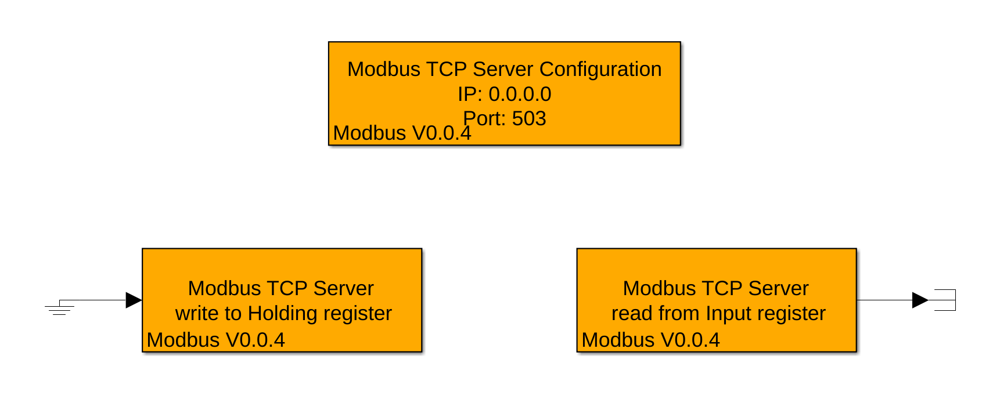

# GOcontroll-Simulink-modbus-tcp

A GOcontroll-Simulink extension blockset for setting up a modbus tcp server

# Install

Download the .mltbx file from the latest release and click it from Matlab to install itIN

# Important notice

The [libmodbus](https://github.com/stephane/libmodbus) project is licensed under an LGPL license, this means that it is not allowed to statically link this library in a non GPL licensed project.  
Therefore you should also make sure that *toolbox folder*/blockset_modbus_tcp/lib/libmodbus/libmodbus.so.5 is uploaded to /usr/lib/aarch64-linux-gnu/ as it needs to be dynamically loaded.  
If this file is not present on the controller and this module is built into your project, the final executable will fail to launch.

# goals

- [x] Create a Modbus TCP Server implementation
- [ ] Add a TCP client implementation
- [ ] Add a RS232 Modbus implementation
- [ ] Add a RS485 Modubs implementation (for use with the Anleg Communication module)